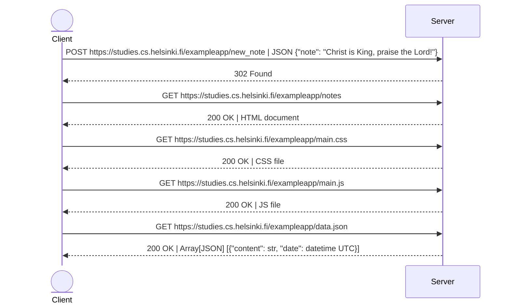

```mermaid
sequenceDiagram

    participant Client@{ "type": "entity" }

    Client ->> Server: POST https://studies.cs.helsinki.fi/exampleapp/new_note | JSON {"note": "Christ is King, praise the Lord!"}

    Server -->> Client: 302 Found

    Client ->> Server: GET https://studies.cs.helsinki.fi/exampleapp/notes

    Server -->> Client: 200 OK | HTML document

    Client ->> Server: GET https://studies.cs.helsinki.fi/exampleapp/main.css

    Server -->> Client: 200 OK | CSS file

    Client ->> Server: GET https://studies.cs.helsinki.fi/exampleapp/main.js

    Server -->> Client: 200 OK | JS file

    Client ->> Server: GET https://studies.cs.helsinki.fi/exampleapp/data.json

    Server -->> Client: 200 OK | Array[JSON] [{"content": str, "date": datetime UTC}]
```
