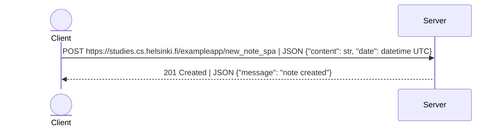

```mermaid
sequenceDiagram

    participant Client@{ "type": "entity" }

    Client ->> Server: POST https://studies.cs.helsinki.fi/exampleapp/new_note_spa | JSON {"content": str, "date": datetime UTC}
    activate Server
    Server -->> Client: 201 Created | JSON {"message": "note created"}
```
