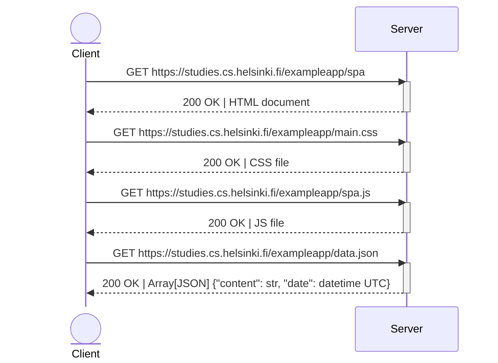

```mermaid
sequenceDiagram

    participant Client@{ "type": "entity" }

    Client ->> Server: GET https://studies.cs.helsinki.fi/exampleapp/spa
    activate Server
    Server -->> Client: 200 OK | HTML document
    deactivate Server

    Client ->> Server: GET https://studies.cs.helsinki.fi/exampleapp/main.css
    activate Server
    Server -->> Client: 200 OK | CSS file
    deactivate Server

    Client ->> Server: GET https://studies.cs.helsinki.fi/exampleapp/spa.js
    activate Server
    Server -->> Client: 200 OK | JS file
    deactivate Server

    Client ->> Server: GET https://studies.cs.helsinki.fi/exampleapp/data.json
    activate Server
    Server -->> Client: 200 OK | Array[JSON] {"content": str, "date": datetime UTC}
    deactivate Server
```
